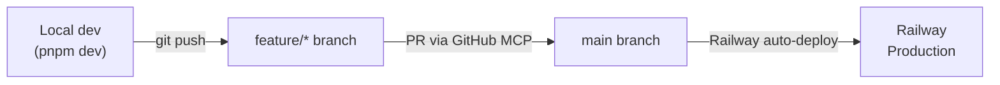
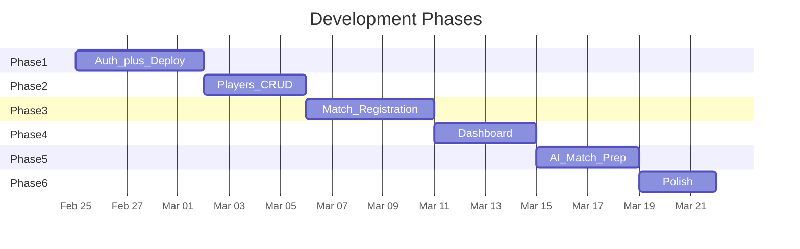

# Tennis Match Tracker -- Development Plan

> **How to get back to this plan:** Open this file in Cursor from the Explorer: `docs/DEVELOPMENT_PLAN.md`. You can also use **Quick Open** (Ctrl+P / Cmd+P) and type `DEVELOPMENT_PLAN`. If you use git, commit this file so it stays with the project everywhere.

---

## Current State (Phase 0 -- complete)

The project at `c:\apps\tennis-match-tracker` already has a solid baseline:

- **Next.js 16** (App Router) + **React 19** + **TypeScript 5.9** (strict)
- **Tailwind CSS 3** + PostCSS + Autoprefixer
- **Vitest** + Testing Library (jsdom) for unit tests
- **ESLint 9** (flat config, Next.js preset) + **Prettier**
- **Zod 4** for runtime validation
- **pnpm** as package manager
- VS Code / Cursor debug & task configs

Key files: [package.json](package.json), [tsconfig.json](tsconfig.json), [src/app/layout.tsx](src/app/layout.tsx), [src/app/page.tsx](src/app/page.tsx).

---

## Stack Additions

| Layer | Choice | Why |
|---|---|---|
| UI components | **shadcn/ui** (+ Radix primitives) | Copy-paste components, Tailwind-native, fully typed, vibecoding-friendly |
| ORM | **Drizzle ORM** + drizzle-kit | Type-safe SQL, lightweight, excellent TS inference, SQL-like syntax |
| Database | **PostgreSQL** on Railway | Managed, one-click provision, matches requirement |
| Auth | **NextAuth v5 (Auth.js)** with Google provider | First-party Next.js integration, Google OAuth only |
| Charts | **Recharts** (or tremor) | React-native, composable, works with Tailwind |
| AI (Phase 5) | **OpenAI API** (or similar LLM) via server action | Game-plan paragraph generation from match data |
| Hosting | **Railway** | Full-stack deploy with GitHub auto-deploys |

---

## Recommended MCPs

Install these in Cursor to accelerate the vibecoding workflow:

- **GitHub MCP** -- create branches, open PRs, review diffs without leaving Cursor
- **Postgres MCP** (`@modelcontextprotocol/server-postgres`) -- query the Railway DB directly from chat to inspect data, debug schemas, seed records
- **Context7 MCP** -- pull up-to-date docs for Next.js, Drizzle, Auth.js, shadcn, etc. inside Cursor context
- **Sequential Thinking MCP** -- help break down complex features into reasoned steps before coding

---

## Git / Deployment Workflow



- Each phase lives on a `feature/<phase-name>` branch
- PR into `main` after manual testing
- Railway auto-deploys `main` (configured in Phase 1)

---

## Phase 1 -- Shell App + Auth + Railway Deploy

**Goal**: A deployed, authenticated skeleton you can open on your phone.

**Branch**: `feature/phase-1-auth-deploy`

### 1a. UI framework

- Install **shadcn/ui** (CLI init), pick a theme, add components: Button, Card, Input, Sheet (mobile nav), Avatar, DropdownMenu
- Build a responsive app shell in [src/app/layout.tsx](src/app/layout.tsx): sidebar on desktop, bottom nav or hamburger on mobile
- Create placeholder pages: `/dashboard`, `/players`, `/matches`, `/prepare`

### 1b. Authentication

- Install `next-auth@beta` (v5) + `@auth/drizzle-adapter`
- Create Google OAuth credentials in Google Cloud Console (callback: `https://<railway-domain>/api/auth/callback/google` + `http://localhost:3000/...` for dev)
- Add auth config at `src/lib/auth.ts`, middleware at `src/middleware.ts` to protect all routes except `/` landing page
- Environment variables: `AUTH_SECRET`, `AUTH_GOOGLE_ID`, `AUTH_GOOGLE_SECRET`
- Login page with Google button, user avatar + sign-out in the nav

### 1c. Railway deploy

- Create Railway account, install Railway CLI
- Create new project with a **PostgreSQL** plugin (one-click)
- Connect the GitHub repo; set `main` branch as auto-deploy trigger
- Add env vars (`DATABASE_URL`, `AUTH_*`) in Railway dashboard
- Verify the app loads on the Railway-provided domain over HTTPS

### 1d. Database foundation

- Install `drizzle-orm`, `drizzle-kit`, `postgres` (driver)
- Create `src/db/index.ts` (connection), `src/db/schema/` folder
- Initial schema: `users`, `accounts`, `sessions` tables (required by Auth.js Drizzle adapter)
- Set up `drizzle.config.ts`, add `pnpm db:push` and `pnpm db:studio` scripts
- Run first migration against Railway Postgres

---

## Phase 2 -- Players / Opponents

**Goal**: Full CRUD for tennis players you might face.

**Branch**: `feature/phase-2-players`

### Schema

```typescript
// src/db/schema/players.ts
export const players = pgTable("players", {
  id: uuid("id").defaultRandom().primaryKey(),
  userId: uuid("user_id").notNull().references(() => users.id),
  name: varchar("name", { length: 255 }).notNull(),
  phone: varchar("phone", { length: 30 }),
  availability: jsonb("availability"),       // e.g. { mon: true, wed: true, sat: true }
  playStyle: varchar("play_style", { length: 100 }),
  strengths: text("strengths"),
  weaknesses: text("weaknesses"),
  notes: text("notes"),
  createdAt: timestamp("created_at").defaultNow().notNull(),
});
```

### Features

- `/players` list page with search/filter (shadcn DataTable or simple card list)
- `/players/new` and `/players/[id]/edit` forms (shadcn Form + Zod validation)
- Server Actions for create / update / delete
- Mobile-friendly card layout
- Tests for validation logic and server actions

---

## Phase 3 -- Match Registration

**Goal**: Record every match with score, type, and personal learnings.

**Branch**: `feature/phase-3-matches`

### Schema

```typescript
// src/db/schema/matches.ts
export const matches = pgTable("matches", {
  id: uuid("id").defaultRandom().primaryKey(),
  userId: uuid("user_id").notNull().references(() => users.id),
  date: date("date").notNull(),
  time: time("time"),
  matchType: varchar("match_type", { length: 20 }).notNull(), // "practice" | "single" | "doubles"
  score: varchar("score", { length: 50 }),
  keyLearnings: text("key_learnings"),
  createdAt: timestamp("created_at").defaultNow().notNull(),
});

export const matchPlayers = pgTable("match_players", {
  id: uuid("id").defaultRandom().primaryKey(),
  matchId: uuid("match_id").notNull().references(() => matches.id),
  playerId: uuid("player_id").notNull().references(() => players.id),
  role: varchar("role", { length: 20 }).notNull(), // "opponent" | "teammate"
});
```

### Features

- `/matches` page with chronological list, filters by type/date/opponent
- `/matches/new` form: date picker, optional time, select opponents from player list, score input, match type radio, key learnings textarea
- `/matches/[id]` detail view + edit
- Server Actions with Zod validation
- Tests

---

## Phase 4 -- Dashboard

**Goal**: Visual overview of your match history and performance trends.

**Branch**: `feature/phase-4-dashboard`

### Features

- `/dashboard` page with summary cards: total matches, win rate, matches this month, most frequent opponent
- **Charts** (Recharts): matches over time (line), win/loss by match type (bar), performance trend
- Recent matches feed
- Filter by date range
- Data fetched via server components + Drizzle queries
- Responsive: cards stack vertically on mobile

---

## Phase 5 -- Match Preparation (AI)

**Goal**: Select an opponent and get an AI-generated game plan paragraph.

**Branch**: `feature/phase-5-match-prep`

### Features

- `/prepare` page: select an opponent from dropdown
- On selection, gather context: opponent characteristics, past match scores, your key learnings from those matches
- Send context to an LLM (OpenAI API via server action) with a prompt like: "Given this opponent profile and our match history, suggest a game plan"
- Display the generated game plan paragraph
- Option to save the game plan to a new `game_plans` table for future reference
- Environment variable: `OPENAI_API_KEY` (added to Railway)

---

## Phase 6 -- Polish and Production Hardening

**Branch**: `feature/phase-6-polish`

- Custom domain setup on Railway
- SEO metadata and Open Graph tags
- Loading skeletons / Suspense boundaries for every page
- Error boundaries and user-friendly error pages
- Rate limiting on AI endpoint
- Lighthouse audit: target 90+ on mobile
- Final README update with architecture diagram

---

## Summary Timeline



Each phase produces a usable, deployed increment. You can start registering players after Phase 2, recording matches after Phase 3, and so on.

---

## Phase checklist

- [ ] **Phase 1a** — Install shadcn/ui, build responsive app shell with nav and placeholder pages
- [ ] **Phase 1b** — Set up NextAuth v5 with Google provider and Drizzle adapter
- [ ] **Phase 1c** — Create Railway account, provision PostgreSQL, connect GitHub repo, deploy
- [ ] **Phase 1d** — Set up Drizzle ORM, initial auth schema, first migration
- [ ] **Phase 2** — Players CRUD: schema, server actions, list/create/edit pages, tests
- [ ] **Phase 3** — Match registration: schema, form with opponents/score/learnings, list/detail pages
- [ ] **Phase 4** — Dashboard: summary cards, Recharts charts, filters, responsive layout
- [ ] **Phase 5** — Match preparation: opponent selector, AI game plan generation via OpenAI
- [ ] **Phase 6** — Polish: custom domain, loading states, error boundaries, Lighthouse audit
