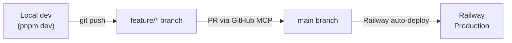
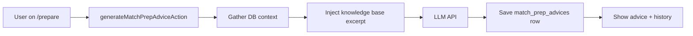
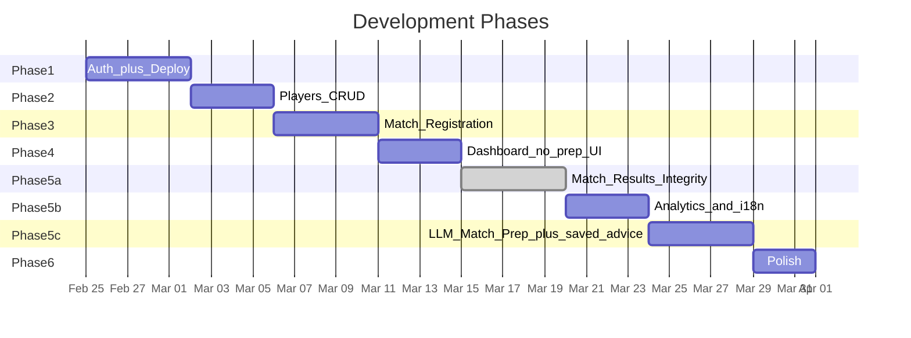

# Tennis Match Tracker -- Development Plan

> **How to get back to this plan:** Open this file in Cursor from the Explorer: `docs/DEVELOPMENT_PLAN.md`. You can also use **Quick Open** (Ctrl+P / Cmd+P) and type `DEVELOPMENT_PLAN`. If you use git, commit this file so it stays with the project everywhere.

---

## Active phase: **5b in progress**

**Phase 5a is deployed**: structured scoring, non-finished results, audio dictation, per-user locale preference, and match integrity checks are live in match registration.

**Phase 5b (current work)**: score-aware dashboard analytics (Tufte sparkline, singles/doubles win-rate cards, combinable filters) and app UI i18n (`en` / `es`). Dashboard and navigation are localized first; remaining pages follow in this phase.

Match preparation is still **not** exposed in the UI — it ships in **Phase 5c**.

---

## Current State (Phase 0 -- complete)

The project at `c:\apps\tennis-match-tracker` already has a solid baseline:

- **Next.js 16** (App Router) + **React 19** + **TypeScript 5.9** (strict)
- **Tailwind CSS 3** + PostCSS + Autoprefixer
- **Vitest** + Testing Library (jsdom) for unit tests
- **ESLint 9** (flat config, Next.js preset) + **Prettier**
- **Zod 4** for runtime validation
- **pnpm** as package manager
- VS Code / Cursor debug & task configs

Key files: [package.json](package.json), [tsconfig.json](tsconfig.json), [src/app/layout.tsx](src/app/layout.tsx), [src/app/page.tsx](src/app/page.tsx).

---

## Stack Additions

| Layer | Choice | Why |
|---|---|---|
| UI components | **shadcn/ui** (+ Radix primitives) | Copy-paste components, Tailwind-native, fully typed, vibecoding-friendly |
| ORM | **Drizzle ORM** + drizzle-kit | Type-safe SQL, lightweight, excellent TS inference, SQL-like syntax |
| Database | **PostgreSQL** on Railway | Managed, one-click provision, matches requirement |
| Auth | **NextAuth v5 (Auth.js)** with Google provider | First-party Next.js integration, Google OAuth only |
| Charts | **Recharts** (or tremor) | React-native, composable, works with Tailwind; Phase 5b adds a Tufte-style per-match sparkline |
| i18n (Phase 5b) | **next-intl** (or equivalent) | Localize UI strings (`en` / `es`) driven by the per-user locale from Phase 5a |
| AI (Phase 5c) | **OpenAI API** (or similar LLM) via server action | Match-prep advice using profiles, match history, and the internal tactical knowledge base as prompt context |
| Hosting | **Railway** | Full-stack deploy with GitHub auto-deploys |

---

## Recommended MCPs

Install these in Cursor to accelerate the vibecoding workflow:

- **GitHub MCP** -- create branches, open PRs, review diffs without leaving Cursor
- **Postgres MCP** (`@modelcontextprotocol/server-postgres`) -- query the Railway DB directly from chat to inspect data, debug schemas, seed records
- **Context7 MCP** -- pull up-to-date docs for Next.js, Drizzle, Auth.js, shadcn, etc. inside Cursor context
- **Sequential Thinking MCP** -- help break down complex features into reasoned steps before coding

---

## Git / Deployment Workflow


```mermaid
flowchart LR
  Local["Local dev\n(pnpm dev)"] -->|"git push"| Feature["feature/* branch"]
  Feature -->|"PR via GitHub MCP"| Main["main branch"]
  Main -->|"Railway auto-deploy"| Prod["Railway\nProduction"]
```

- Each phase lives on a `feature/<phase-name>` branch
- PR into `main` after manual testing
- Railway auto-deploys `main` (configured in Phase 1)

---

## Phase 1 -- Shell App + Auth + Railway Deploy

**Goal**: A deployed, authenticated skeleton you can open on your phone.

**Branch**: `feature/phase-1-auth-deploy`

### 1a. UI framework

- Install **shadcn/ui** (CLI init), pick a theme, add components: Button, Card, Input, Sheet (mobile nav), Avatar, DropdownMenu
- Build a responsive app shell in [src/app/layout.tsx](src/app/layout.tsx): sidebar on desktop, bottom nav or hamburger on mobile
- Create placeholder pages: `/dashboard`, `/players`, `/matches` (`/prepare` added in Phase 5c)

### 1b. Authentication

- Install `next-auth@beta` (v5) + `@auth/drizzle-adapter`
- Create Google OAuth credentials in Google Cloud Console (callback: `https://<railway-domain>/api/auth/callback/google` + `http://localhost:3000/...` for dev)
- Add auth config at `src/lib/auth.ts`, middleware at `src/middleware.ts` to protect all routes except `/` landing page
- Environment variables: `AUTH_SECRET`, `AUTH_GOOGLE_ID`, `AUTH_GOOGLE_SECRET`
- Login page with Google button, user avatar + sign-out in the nav

### 1c. Railway deploy

- Create Railway account, install Railway CLI
- Create new project with a **PostgreSQL** plugin (one-click)
- Connect the GitHub repo; set `main` branch as auto-deploy trigger
- Add env vars (`DATABASE_URL`, `AUTH_*`) in Railway dashboard
- Verify the app loads on the Railway-provided domain over HTTPS

### 1d. Database foundation

- Install `drizzle-orm`, `drizzle-kit`, `postgres` (driver)
- Create `src/db/index.ts` (connection), `src/db/schema/` folder
- Initial schema: `users`, `accounts`, `sessions` tables (required by Auth.js Drizzle adapter)
- Set up `drizzle.config.ts`, add `pnpm db:push` and `pnpm db:studio` scripts
- Run first migration against Railway Postgres

---

## Phase 2 -- Players / Opponents

**Goal**: Full CRUD for tennis players you might face.

**Branch**: `feature/phase-2-players`

### Schema

```typescript
// src/db/schema/players.ts
export const players = pgTable("players", {
  id: uuid("id").defaultRandom().primaryKey(),
  userId: uuid("user_id").notNull().references(() => users.id),
  name: varchar("name", { length: 255 }).notNull(),
  phone: varchar("phone", { length: 30 }),
  availability: jsonb("availability"),       // e.g. { mon: true, wed: true, sat: true }
  playStyle: varchar("play_style", { length: 100 }),
  strengths: text("strengths"),
  weaknesses: text("weaknesses"),
  notes: text("notes"),
  createdAt: timestamp("created_at").defaultNow().notNull(),
});
```

### Features

- `/players` list page with search/filter (shadcn DataTable or simple card list)
- `/players/new` and `/players/[id]/edit` forms (shadcn Form + Zod validation)
- Server Actions for create / update / delete
- Mobile-friendly card layout
- Tests for validation logic and server actions

---

## Phase 3 -- Match Registration

**Goal**: Record every match with score, type, and notes.

**Branch**: `feature/phase-3-matches`

### Schema

```typescript
// src/db/schema/matches.ts
export const matches = pgTable("matches", {
  id: uuid("id").defaultRandom().primaryKey(),
  userId: uuid("user_id").notNull().references(() => users.id),
  date: date("date").notNull(),
  time: time("time"),
  matchType: varchar("match_type", { length: 20 }).notNull(), // "practice" | "single" | "doubles"
  score: varchar("score", { length: 50 }),
  notes: text("notes"),
  createdAt: timestamp("created_at").defaultNow().notNull(),
});

export const matchPlayers = pgTable("match_players", {
  id: uuid("id").defaultRandom().primaryKey(),
  matchId: uuid("match_id").notNull().references(() => matches.id),
  playerId: uuid("player_id").notNull().references(() => players.id),
  role: varchar("role", { length: 20 }).notNull(), // "opponent" | "teammate"
});
```

### Features

- `/matches` page with chronological list, filters by type/date/opponent
- `/matches/new` form: date picker, optional time, select opponents from player list, score input, match type radio, notes textarea
- `/matches/[id]` detail view + edit
- Server Actions with Zod validation
- Tests

---

## Phase 4 -- Dashboard *(current release)*

**Goal**: Visual overview of your match history and performance trends. **No match preparation UI in this phase.**

**Branch**: `feature/phase-4-dashboard`

### Features

- `/dashboard` page with summary cards: total matches, win rate, matches this month, most frequent opponent
- **Charts** (Recharts): matches over time (line), win/loss by match type (bar), performance trend
- Recent matches feed
- Filter by date range
- Data fetched via server components + Drizzle queries
- Responsive: cards stack vertically on mobile
- **Prepare** hidden from navigation; `/prepare` redirects to dashboard

> Phase 4 ships the **baseline** dashboard (aggregate monthly charts, single combined win rate). Score- and completion-aware analytics — singles/doubles win-rate cards, the Tufte-style per-match sparkline, and combinable filters — are upgraded in **Phase 5b**.

### Internal groundwork (not user-facing)

- Tactical knowledge base under `src/lib/match-prep/` (sources, tactic library, LLM context builder)
- `buildMatchPrepPromptContext()` assembles opponent profile, H2H history, last 5 user matches, and knowledge-base markdown for future LLM calls

---

## Phase 5a -- Match Result Completion & Integrity *(shipped)*

**Goal**: Make match registration robust for finished and non-finished matches, with structured scoring, audio notes, language-aware dictation, and integrity validation.

**Branch**: `feature/phase-5a-match-results` (merged)

### Schema (extends Phase 3)

```typescript
// src/db/schema/matches.ts (additions)
// result:       "win" | "loss" | "non_finished"
// score:        auto-generated display string (legacy matches keep user-typed free text)
// notesAudioUrl: reference to a recorded audio note

// src/db/schema/match-score-segments (one row per segment)
// segmentOrder + segmentType ("set" | "long_set" | "tie_break" | "super_tie_break")
// userGamesOrPoints + opponentGamesOrPoints

// src/db/schema/user-preferences.ts
// userId (PK) + locale ("en" | "es", default "en")
```

### Features (delivered)

- **Match result status** (`win` | `loss` | `non_finished`):
  - `non_finished` counts as **played** but is excluded from all win-rate numerators/denominators
  - `outcome`/`score` columns widened; existing rows remain compatible
- **Structured score registration** — segment-by-segment flow:
  - Create each segment in order: Set (to 6), Long Set (to 9), Tie Break, or Super Tie Break
  - Record games (or points, for tie breaks) for user and opponent per segment
  - App auto-generates the canonical `score` display string (e.g. `6-4 7-6(5)`, `[10-8]`)
- **Legacy score compatibility**:
  - Old matches may only have the optional free-text `score`; UI and analytics tolerate both formats
  - New/edited matches populate `score` automatically — users no longer type it manually
- **User language preference (foundation)**:
  - Persisted locale per user (`en` | `es`), selectable in **Account**
  - Single source of truth reused by Phase 5b (UI i18n) and Phase 5c (AI output)
- **Audio match notes**:
  - Dictate notes in the match form via the browser Web Speech API, using the user's locale (`en-US` / `es-ES`)
  - `notesAudioUrl` reserved for stored audio; typed notes remain supported (free-form language)
- **Integrity controls and review**:
  - Validate segments against tennis rules and detect result/score contradictions (e.g. `win` while the score implies a loss)
  - Surface warnings before save; integrity panel on match detail
  - Unit tests for score formatting, segment validation, and result/score consistency

**Functional increment**: Users can fully register real-world matches — including interrupted/non-finished ones — with auditable score details and integrity validation.

---

## Phase 5b -- Score-Aware Analytics & App i18n

**Goal**: Upgrade the dashboard to score- and completion-aware analytics (including Tufte-style per-match visualization) and localize the app UI, building on the Phase 5a data model and locale preference.

**Branch**: `feature/phase-5b-analytics-i18n`

### Score-aware analytics

- **Separate win-rate cards** shown in parallel:
  - Singles win rate
  - Doubles win rate
  - `non_finished` excluded from both (played, but never counted)
- **Tufte-style "matches over time"** (replaces the aggregate monthly line chart), inspired by Edward Tufte's *Beautiful Evidence*:
  - X axis = **each match**, ordered by date/time (not aggregated per month)
  - **Upward** whisker/marker for a win
  - **Downward** whisker/marker for a loss
  - Neutral baseline marker for `non_finished`
  - High-data-density, minimal styling (thin strokes, no chart junk)
- **Combinable filters** that recompute the sparkline and cards live:
  - Date range, match type (singles / doubles / practice), opponent, completion status
  - Filters stack so the user can explore any subset
- Analytics queries read **both** legacy free-text scores and structured segment data
- Add query-layer aggregates/indexes if needed for efficient filtered analytics

### App UI internationalization (i18n)

- **In scope**: all user-facing UI strings — navigation, page titles, form labels, buttons, validation/error messages, dashboard cards, chart labels, empty states
- **Out of scope**: user-generated content (typed notes, transcribed audio, opponent names, legacy scores) — kept in whatever language the user wrote/spoke
- Reuse the locale preference from Phase 5a (same selector; no duplicate setting)
- Implementation: Next.js i18n (e.g. `next-intl`) with `en` / `es` message catalogs; locale drives the HTML `lang` attribute and date/number formatting
- Tests for locale switching and key UI strings in both languages

**Functional increment**: Users can use the app in their language and read a dashboard whose metrics and per-match visualization correctly reflect structured scores and completion state.

---

## Phase 5c -- Match Preparation (LLM)

**Goal**: User selects an opponent and upcoming match date, requests AI advice, and can review past advice without re-calling the API.

**Branch**: `feature/phase-5c-match-prep`

### User experience

- Enable **Prepare** in app navigation (`CURRENT_APP_PHASE >= 5`)
- `/prepare` page:
  1. Select **opponent** (from players list)
  2. Select **date** of the upcoming match
  3. Click **Get advice** → server action calls the LLM
  4. Display **tactical advice** and a **game plan** (markdown or structured sections)
  5. **History**: list past advice for this opponent / date, open any saved entry without a new API call

### LLM request — context payload

The API call must include everything available (advice is still generated if some sections are empty):

| Context | Source |
|---------|--------|
| Opponent profile | `players` — play style, strengths, weaknesses, notes |
| Your profile | `users` — profile play style, strengths, weaknesses |
| Matches vs opponent | `matches` + `match_players` filtered by opponent |
| Your last 5 matches | Recent matches for pattern detection |
| Tactical knowledge base | `formatKnowledgeBaseForLlm()` — filtered tactics + source registry (not shown raw to user) |

Implementation: [src/lib/match-prep/build-prep-prompt-context.ts](../src/lib/match-prep/build-prep-prompt-context.ts), [src/lib/match-prep/knowledge-base.ts](../src/lib/match-prep/knowledge-base.ts).


```mermaid
flowchart LR
  user[User on /prepare] --> action[generateMatchPrepAdviceAction]
  action --> gather[Gather DB context]
  gather --> kb[Inject knowledge base excerpt]
  kb --> llm[LLM API]
  llm --> save[Save match_prep_advices row]
  save --> ui[Show advice + history]
```

### Tactical knowledge base (evolvable)

- **Not** a user-facing library — tactics and sources are **prompt context** so the LLM gives grounded, useful answers
- Curated sources in `sources.ts` (ITF, USTA, coaching publications, club manuals, etc.)
- Tactic entries in `tactic-library.ts` with citations, archetypes, and situations
- `KNOWLEDGE_BASE_VERSION` bumped when tactics/sources change materially
- New references: add markdown under `docs/match-prep/`, register in `sources.ts`, add paraphrased tactics to `tactic-library.ts`
- See [docs/match-prep/README.md](match-prep/README.md)

### Schema — saved advice

```typescript
// src/db/schema/match-prep-advice.ts (Phase 5c)
export const matchPrepAdvices = pgTable("match_prep_advices", {
  id: text("id").primaryKey(),
  userId: text("user_id").notNull().references(() => users.id),
  opponentId: text("opponent_id").references(() => players.id),
  plannedMatchDate: date("planned_match_date").notNull(),
  adviceMarkdown: text("advice_markdown").notNull(),
  /** Snapshot of prompt context metadata for audit / replay */
  contextSnapshot: jsonb("context_snapshot"),
  knowledgeBaseVersion: varchar("knowledge_base_version", { length: 20 }),
  modelId: varchar("model_id", { length: 100 }),
  createdAt: timestamp("created_at").defaultNow().notNull(),
});
```

### Server / env

- Server action: `generateMatchPrepAdviceAction({ opponentId, plannedMatchDate })`
- Environment variable: `OPENAI_API_KEY` (Railway staging + production)
- Rate limiting on the advice endpoint (Phase 6 polish)

### Tests

- Prompt context builder (missing sections, knowledge base inclusion)
- Action validation and persistence
- Optional: mocked LLM response snapshot

---

## Phase 6 -- Polish and Production Hardening

**Branch**: `feature/phase-6-polish`

- Create app branding assets:
  - Primary logo (SVG + PNG variants) for the app header/auth screens and social preview
  - Favicon set for browser tabs/bookmarks (`favicon.ico`, `icon.svg`, and touch icon)
- Wire branding into app entry points:
  - Logo in main navigation/header and login/landing surfaces
  - Configure favicon/icons in Next.js App Router metadata (`src/app/`) and validate across desktop/mobile browsers
- Custom domain setup on Railway
- SEO metadata and Open Graph tags
- Loading skeletons / Suspense boundaries for every page
- Error boundaries and user-friendly error pages
- Rate limiting on AI endpoint
- Lighthouse audit: target 90+ on mobile
- Final README update with architecture diagram

---

## Summary Timeline


```mermaid
gantt
  title Development Phases
  dateFormat YYYY-MM-DD
  axisFormat %b %d

  section Phase1
  Auth_plus_Deploy :p1, 2026-02-25, 5d

  section Phase2
  Players_CRUD :p2, after p1, 4d

  section Phase3
  Match_Registration :p3, after p2, 5d

  section Phase4
  Dashboard_no_prep_UI :p4, after p3, 4d

  section Phase5a
  Match_Results_Integrity :done, p5a, after p4, 5d

  section Phase5b
  Analytics_and_i18n :p5b, after p5a, 4d

  section Phase5c
  LLM_Match_Prep_plus_saved_advice :p5c, after p5b, 5d

  section Phase6
  Polish :p6, after p5c, 3d
```

Each phase produces a usable, deployed increment. You can register players after Phase 2, record matches after Phase 3, register structured scores and non-finished results after Phase 5a, read score-aware analytics in a localized UI after Phase 5b, and use AI match preparation after Phase 5c.

---

## Phase checklist

- [x] **Phase 1a** — Install shadcn/ui, build responsive app shell with nav and placeholder pages
- [x] **Phase 1b** — Set up NextAuth v5 with Google provider and Drizzle adapter
- [x] **Phase 1c** — Create Railway account, provision PostgreSQL, connect GitHub repo, deploy
- [x] **Phase 1d** — Set up Drizzle ORM, initial auth schema, first migration
- [x] **Phase 2** — Players CRUD: schema, server actions, list/create/edit pages, tests
- [x] **Phase 3** — Match registration: schema, form with opponents/score/notes, list/detail pages
- [x] **Phase 4** — Dashboard: summary cards, Recharts charts, filters, responsive layout; Prepare hidden
- [x] **Phase 5a** — Match results & integrity: non-finished result, structured score segments (set/long set/tie break/super tie break), auto-generated score string, legacy compatibility, user locale, audio dictation, integrity validation and tests
- [ ] **Phase 5b** — Score-aware analytics & i18n: singles/doubles win-rate cards, Tufte-style per-match sparkline (up = win, down = loss, neutral = non-finished), combinable filters, full UI i18n (en/es) using the Phase 5a locale
- [ ] **Phase 5c** — LLM match prep: opponent + date, advice generation, saved advice history, knowledge base as prompt context
- [ ] **Phase 6** — Polish: app logo + favicon, custom domain, loading states, error boundaries, Lighthouse audit
